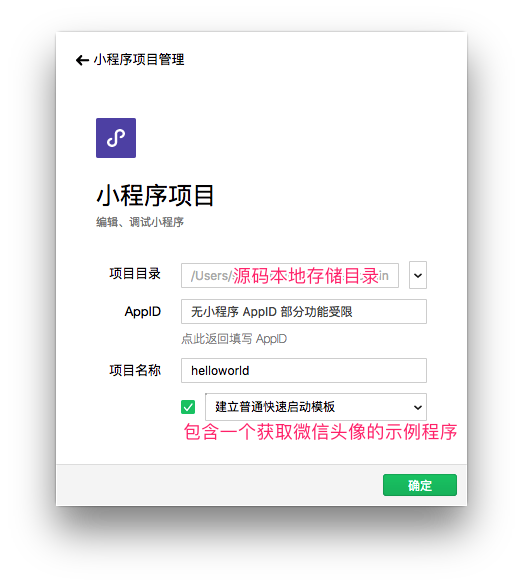
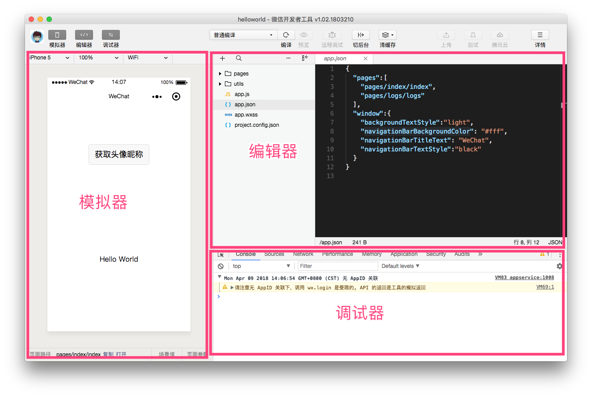
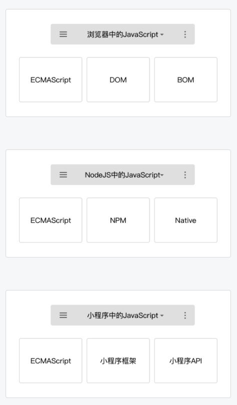
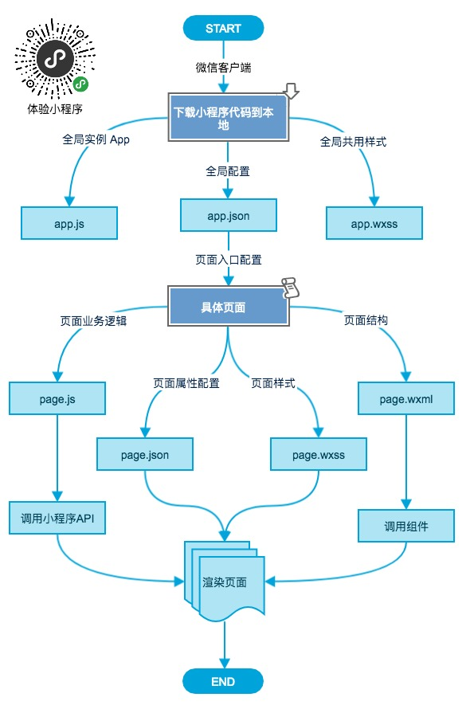
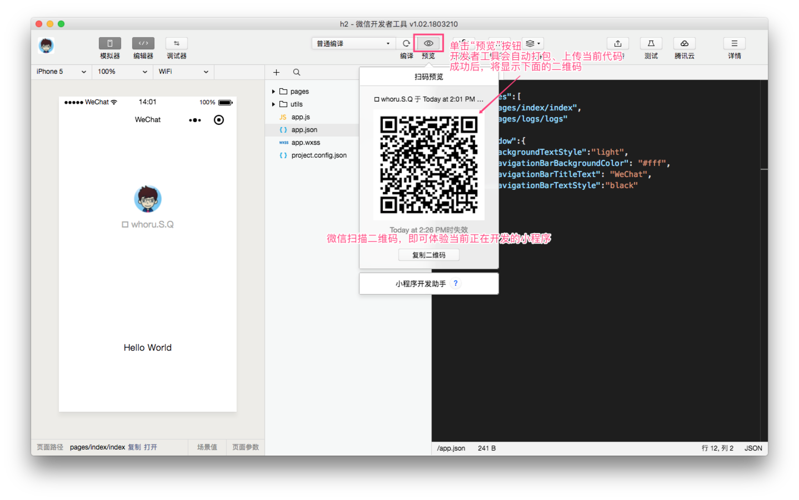
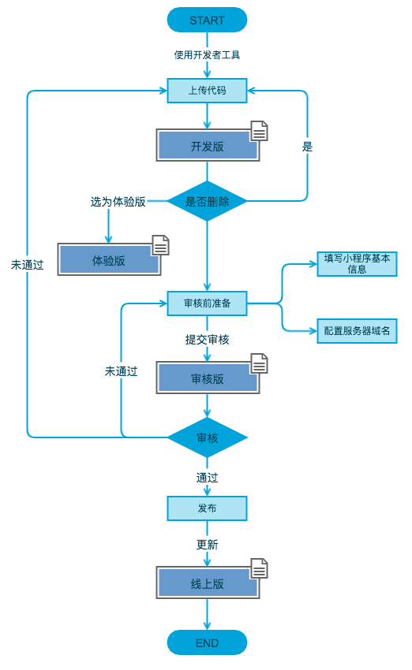

小程序开发之基础入门篇
---

### 目录

1. [起步](#1-起步)
	- 1.1. [申请账号](#11-申请账号)
	- 1.2. [安装开发者工具](#12-安装开发者工具)
	- 1.3. [Hello World](#13-hello-world)
2. [基本项目结构](#2-基本项目结构)
	- 2.1. [json](#21-json)
	- 2.2. [wxml](#22-wxml)
	- 2.3. [wxss](#23-wxss)
	- 2.4. [js](#24-js)
3. [执行流程](#3-执行流程)
4. [发布](#4-发布)
	- 4.1. [设置用户身份](#41-设置用户身份)
	- 4.2. [测试预览](#42-测试预览)
	- 4.3. [上传代码及发布上线](#43-上传代码及发布上线)
5. [其它](#5-其它)
	- 5.1. [查看小程序运营数据](#51-查看小程序运营数据)
	- 5.2. [相关资源](#52-相关资源)

---

### 1. 起步

#### 1.1. 申请账号

地址：[https://mp.weixin.qq.com/wxopen/waregister?action=step1](https://mp.weixin.qq.com/wxopen/waregister?action=step1)

注册所填写信息：

- 邮箱
- 身份证姓名
- 身份证号（一个身份证号码只能注册5个小程序）
- 手机号（一个手机号码只能注册5个小程序）
- 扫码绑定一个微信账号为管理者

不同主体类型间的区别如下：

<table>
    <tr>
        <th>主体类型</th> 
        <th>需补充资料</th>
        <th>说明</th> 
   </tr>
    <tr>
        <td>个人</td> 
        <td>无</td>
        <td>暂不支持微信认证，<a href="https://developers.weixin.qq.com/miniprogram/introduction/#面向个人开发者开放的服务类目">点击查看</a>面向个人开发者开放的服务类目。</td>
    </tr>
    <tr>
        <td rowspan="3">企业</td> 
        <td>企业名称</td>
        <td rowspan="3">可选是否进行<a href="https://developers.weixin.qq.com/miniprogram/introduction/#填写主体信息并选择验证方式">主体身份验证</a>，认证方式：1. 对公账户打款；2.  微信认证。如果想要申请微信支付权限，则必须通过微信认证。</td>
    </tr>
    <tr>
        <td>营业执照注册号</td>
    </tr>
    <tr>
        <td>注册方式</td>
    </tr>
    <tr>
        <td rowspan="2">政府</td> 
        <td>政府全称</td>
        <td rowspan="2">必须通过微信认证的方式验证主体身份，在认证完成前小程序部分能力暂不支持。</td>
    </tr>
    <tr>
        <td>注册方式</td>
    </tr>
    <tr>
        <td rowspan="4">媒体</td> 
        <td>组织名称（审核成功后，不可修改）</td>
        <td rowspan="4">同上</td>
    </tr>
    <tr>
        <td>组织机构代码</td>
    </tr>
    <tr>
        <td>组织机构代码证（加盖公章的扫描件）</td>
    </tr>
    <tr>
        <td>注册方式</td>
    </tr>
    <tr>
        <td rowspan="4">其它组织类型</td> 
        <td>同媒体类型</td>
        <td>同上</td>
    </tr>
</table>

如何选择主体类型，参加[官方说明](https://kf.qq.com/faq/120911VrYVrA130619v6zaAn.html)。

注册成功后进入后台，通过菜单“设置 - 开发设置”得到小程序对应的 **AppID**（小程序身份标识），同时后台拥有的其它功能如：管理小程序权限、查看数据报表、发布小程序等。

#### 1.2. 安装开发者工具

下载地址：

- [Windows 64](https://servicewechat.com/wxa-dev-logic/download_redirect?type=x64&from=mpwiki)
- [Windows 32](https://servicewechat.com/wxa-dev-logic/download_redirect?type=ia32&from=mpwiki)
- [macOS](https://servicewechat.com/wxa-dev-logic/download_redirect?type=darwin&from=mpwiki)

该工具集成了**公众号网页调试**和**小程序调试**两种开发模式：

- 使用公众号网页调试，开发者可以调试微信网页授权和微信 JS-SDK 等功能。 [详情](https://mp.weixin.qq.com/wiki?t=resource/res_main&id=mp1421141115)
- 使用小程序调试，开发者可以完成小程序的 API 和页面的开发调试、代码查看和编辑、小程序预览和发布等功能。

关于该工具的详细介绍，请[点击这里](https://mp.weixin.qq.com/debug/wxadoc/dev/devtools/devtools.html?t=2018327)。

#### 1.3. Hello World

1. 打开开发者工具，选择小程序；
2. 项目配置：

    

3. 查看效果

    

    在左侧的模拟器中，单击“获取头像昵称”，将得到当前开发者工具已登录微信账号对应的头像、昵称。
    
    > **注意：因为没有填写 AppID，所以开发者工具有一些功能限制，比如上图右上角中“预览”、“远程调试”等按钮是灰色。**

### 2. 基本项目结构

通过上一步创建的快速预览项目，我们可以看到，小程序主要由 `*.json、*.js、*.wxss、*.wxml` 四类文件组成，详细的说明见下文。

#### 2.1. json

> 文件扩展名：*.json

主要实现一些静态配置的功能，分为以下 3 类：

- 根目录下的 **app.json**

    对当前小程序的全局配置，包括：所有页面路径、界面表现、网络超时时间、底部 tab 等，[详见这里](https://developers.weixin.qq.com/miniprogram/dev/framework/config.html)。 

- 根目录下的 **project.config.json**

    对当前开发者工具的配置，界面颜色、编译配置等，[详见这里](https://developers.weixin.qq.com/miniprogram/dev/devtools/edit.html#项目配置文件)。 

- **[page].json**

    存在于每个页面（模块）对应的目录底下，用于配置每个页面的独立属性，[详见这里](https://developers.weixin.qq.com/miniprogram/dev/framework/config.html)。 

#### 2.2. wxml

> 文件扩展名：*.wxml

WXML 全称是 WeiXin Markup Language，是小程序框架设计的一套标签语言，结合小程序的基础组件、事件系统，可以构建出页面的结构。其相当于 **HTML**，但是在 div、p、span 这些标签的基础上，做了一些封装，添加了一些类似 `wx:if` 的属性表达式等，以实现更多的功能，[详见这里](https://developers.weixin.qq.com/miniprogram/dev/framework/view/wxml/)。

基本特性简介：

- 由开始标签和结束标签组成，而且必须严格闭合，比如 `<view></view>`；
- 标签可以拥有属性，格式 `key="value"`，大小写敏感；

    所有组件的**共同属性**如下：
    
    <table>
        <tr>
            <th>属性名</th>
            <th>类型</th>
            <th>描述</th>
            <th>说明</th>
        </tr>
        <tr>
            <td>id</td>
            <td>String</td>
            <td>组件的唯一标识</td>
            <td>整个页面唯一</td>
        </tr>
        <tr>
            <td>class</td>
            <td>String</td>
            <td>组件的样式类</td>
            <td>对应 wxss 文件中定义的样式类</td>
        </tr>
        <tr>
            <td>style</td>
            <td>String</td>
            <td>组件的内联样式</td>
            <td></td>
        </tr>
        <tr>
            <td>hidden</td>
            <td>Boolean</td>
            <td>组件是否显示</td>
            <td>所有组件默认显示</td>
        </tr>
        <tr>
            <td>data-*</td>
            <td>Any</td>
            <td>自定义属性</td>
            <td>组件上触发的事件时，会发送给事件处理函数</td>
        </tr>
        <tr>
            <td>bind*/catch*</td>
            <td>EventHandler</td>
            <td>组件的事件</td>
            <td></td>
        </tr>
    </table>

- 数据绑定功能，通过 `{{变量名}}` 来绑定 wxml 文件对应 js 文件中的 data 对象属性；
    - 变量名大小写敏感；
    - 没有被定义的变量的或者是被设置为 undefined 的变量不会被同步到 wxml 中；
- 在 `{{ }}` 内进行简单的逻辑运算
- 条件逻辑 `wx:if="{{condition}}"`
- 列表渲染 `wx:for="{{array}}"`
- 模版 `<template name="">...</template>`
- 引用其它文件
    - import
    - include

#### 2.3. wxss

> 文件扩展名：*.wxss

WXSS（WeiXin Style Sheets）是一套用于小程序的样式语言，相当于 **CSS**，但是做了一些扩充和修改，[详见这里](https://developers.weixin.qq.com/miniprogram/dev/framework/view/wxss.html)：

- 根目录下 app.wxss 为项目公共样式，各页面共用，其它 *.wxss 适用于具体页面；
- 新增了尺寸单位 rpx（responsive pixel）;

    > rpx 的换算是以 375 个物理像素为基准，也就是在一个宽度为 375 物理像素的屏幕下，1rpx = 1px。
    推荐以 iPhone6 屏幕（宽度为 375px，共 750 个物理像素）为设计基准，此时 1rpx = 375 / 750px = 0.5px

- 引用其它样式文件 `@import './test.wxss'`
- 仅支持部分 CSS 选择器：

    <table>
        <tr>
            <th>类型</th>
            <th>选择器</th>
            <th>示例</th>
            <th>说明</th>
        </tr>
        <tr>
            <td>类选择器</td>
            <td>.class</td>
            <td>.intro</td>
            <td>选择所有拥有 class="intro" 的组件</td>
        </tr>
        <tr>
            <td>id选择器</td>
            <td>#id</td>
            <td>#firstname</td>
            <td>选择拥有 id="firstname" 的组件</td>
        </tr>
        <tr>
            <td>元素选择器</td>
            <td>element</td>
            <td>view checkbox</td>
            <td>选择所有文档的 view 组件和所有的 checkbox 组件</td>
        </tr>
        <tr>
            <td>伪元素选择器</td>
            <td>::after</td>
            <td>view::after</td>
            <td>在 view 组件后边插入内容</td>
        </tr>
        <tr>
            <td>伪元素选择器</td>
            <td>::before</td>
            <td>view::before</td>
            <td>在 view 组件前边插入内容</td>
        </tr>
    </table>

- 样式的权重遇 CSS 类似，从大到小为 `!important > style="" > #id > .class > element`
- 官方样式库：[https://github.com/Tencent/weui-wxss](https://github.com/Tencent/weui-wxss)

#### 2.4. js

> 文件扩展名：*.js

小程序的主要开发语言是 JavaScript ，开发者使用它响应用户操作、开发业务逻辑，以及调用[小程序 API](https://developers.weixin.qq.com/miniprogram/dev/api/)来完成业务需求。

ECMAScript 是一种由 Ecma 国际通过 ECMA-262 标准化的脚本程序设计语言， JavaScript 是 ECMAScript 的一种实现。

ECMA-262 规定了 ECMAScript 语言的几个重要组成部分：

- 语法
- 类型
- 语句
- 关键字
- 操作符
- 对象

JavaScript 实现形式对比：

 小程序中的 JavaScript 是由 ECMAScript 以及小程序框架和小程序 API 来实现的。同浏览器中的 JavaScript 相比，没有 BOM 以及 DOM 对象，所以类似 JQuery、Zepto 这种浏览器类库是无法在小程序中运行起来的，同样的缺少 Native 模块和 NPM 包管理的机制，小程序中无法加载原生库，也无法直接使用大部分的 NPM 包。

小程序的执行的入口文件是 app.js，并且会根据其中 require 的模块顺序决定文件的运行顺序。

当 app.js 执行结束后，小程序会按照开发者在 app.json 中定义的 pages 的顺序，逐一执行。

### 3. 执行流程

说明：

- 通过 app.json 中配置的第一个页面为小程序的首页。
- 客户端装载页面代码，并通过底层一些机制，将页面渲染出来。

### 4. 发布

#### 4.1. 设置用户身份

对于一个由团队开发的小程序项目，给每个参与人员设置不同的身份权限是十分必要的，通过后台菜单 `用户身份 - 成员管理` 进行设置，不同权限的区别如下：

<table>
    <tr>
        <th>权限类型</th>
        <th>说明</th>
    </tr>
    <tr>
        <td>开发者权限</td>
        <td>可使用小程序开发者工具及开发版小程序进行开发</td>
    </tr>
    <tr>
        <td>体验者权限</td>
        <td>可使用体验版小程序</td>
    </tr>
    <tr>
        <td>登录</td>
        <td>可登录小程序管理后台，无需管理员确认</td>
    </tr>
    <tr>
        <td>数据分析</td>
        <td>使用小程序数据分析功能查看小程序数据</td>
    </tr>
    <tr>
        <td>开发管理</td>
        <td>小程序提交审核、发布、回退</td>
    </tr>
    <tr>
        <td>开发设置</td>
        <td>设置小程序服务器域名、消息推送及扫描普通链接二维码打开小程序</td>
    </tr>
    <tr>
        <td>暂停服务设置</td>
        <td>暂停小程序线上服务</td>
    </tr>
</table>

#### 4.2. 测试预览

使用开发者工具，如下操作：

> 提示：如果创建项目的时候，没有填写 AppID，该按钮是灰色不可用。

#### 4.3. 上传代码及发布上线

同样通过开发者工具，单击右上角的“上传”按钮，确定上传并填写以下两个字段：

- 版本号

    必填，仅限字母、数字，如 `v1.0.0`

- 项目备注

    非必填，是对本次上传对特别说明信息。
    
上传成功后成为【开发版】，小程序管理员可在后台将本次上传设置为【体验版】，或提交审核成为【审核中版本】，审核通通过后，可发布小程序，成为【线上版】，具体流程如下：

> **说明**：
>
> 1. 【开发版】只保留每人最新上传的一份代码，可随意删除，不影响审核版和线上版。
> 2. 只能由一份代码处于【审核版】，有审核结果后，可发布上线或重新提交审核。
> 3. 【线上版】会被每次发布的新版本覆盖。

可扫描下面的二维码，通过**小程序开发者助手**快捷的体验以上各版本。

### 5. 其它

#### 5.1. 查看小程序运营数据

- 方式一：登录[小程序管理后台]()，打开菜单“数据分析”；

- 方式二：微信扫描下面对二维码，使用**小程序数据助手**工具

    

#### 5.2. 相关资源

- [官方文档](https://developers.weixin.qq.com/miniprogram/dev/index.html?t=2018329)
- [微信开发者社区](https://developers.weixin.qq.com/home?)
- [小程序开发资源汇总](https://github.com/justjavac/awesome-wechat-weapp)
- 更新日志
    - [小程序](https://developers.weixin.qq.com/miniprogram/dev/devtools/new.html)
    - [开发者工具](https://developers.weixin.qq.com/miniprogram/dev/devtools/uplog.html)